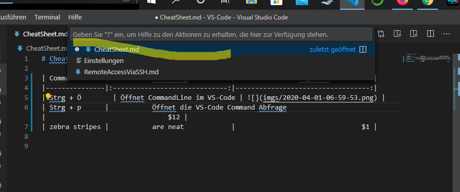

# Cheatsheet VS-Code

| Command  |             Umsetzung              |                mögliche Parameter |
|----------|:----------------------------------:|----------------------------------:|
| Strg + Ö |   Öffnet CommandLine im VS-Code    |  |
| Strg + p | Öffnet die VS-Code Command Abfrage |  |
|          |                                    |                                   |

|  |                      |                           |

