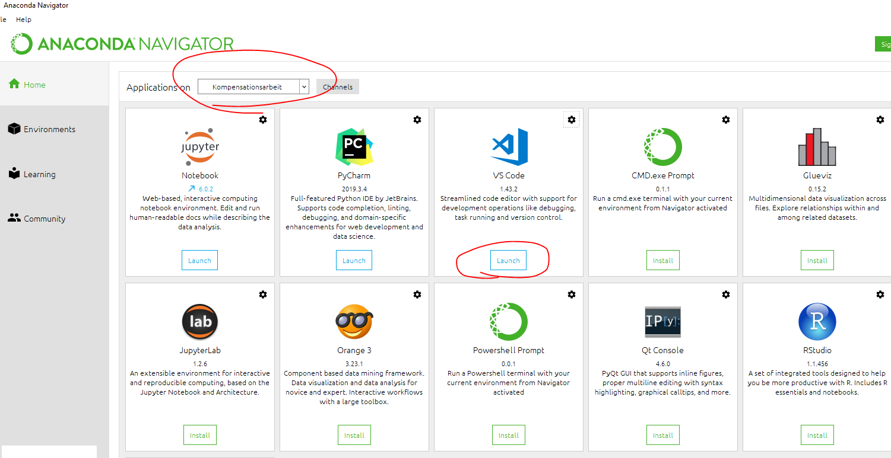
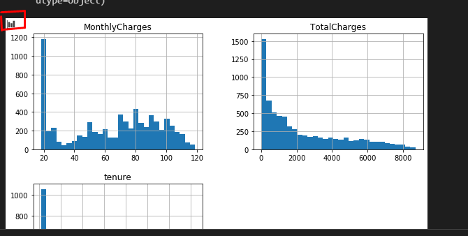
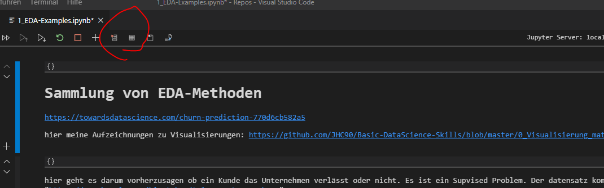
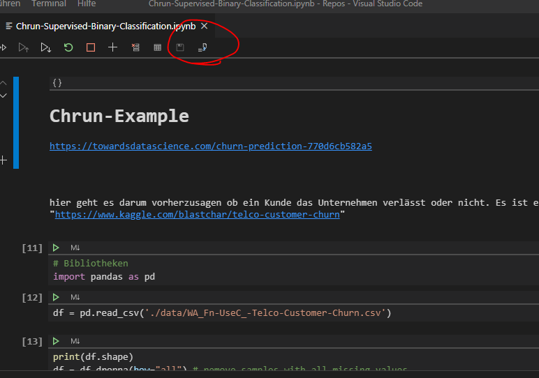

[Link](linToJupyterRollout)

Hier wollen wir die Jupyter notebooks in VS-Code Pflegen

bsp kann man damit mit dem Plugin [MarkdownPaste](Link) problemlos via tastenkombination bilder einfügen

## Best-Practise Implementierung
1. Install Anaconda
2. Install VS-Code
3. In Anaconda check dass die richtige Env ausgewählt ist beim öffnen von Jupyter Notbook

4. öffne existetnes Jupyter (ich glaub in Git find ich eins)

## Usage
* Plot Viewer
  

* Data & Variable Viewer

Hier können die Daten&Laufzeitvariablen betrachtet werden

* hot-Keys
  
| Tastenkombination  | Auswirkung  |
|---|---|
| strg + enter  | run active cell   |
|   |   | 
|   |   | 
  
# Jupyter Server
man kann relativ easy und schnell mit einem Remote jupyter Server verbinden

# Convert to Python code

hiermit kann man aus dem Python Code Production Code erstellen. Das geht nur wenn das Jupyter von 0 an in der Vsocdeo

In diesem Mode kann man dann auch wunderbar Debuggen indem man code linewise ausführt