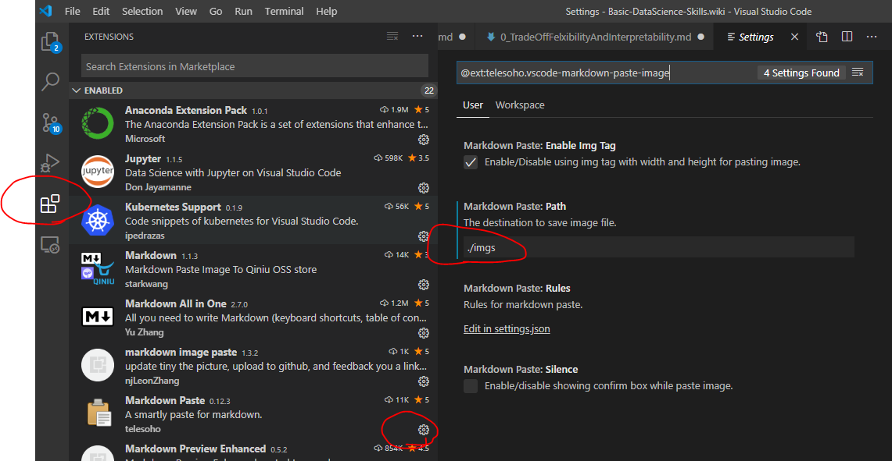
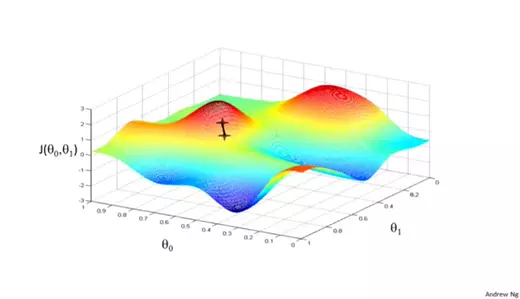

# 1. Table of Contents
[Erklärung wie man TOC einfügt in VSCode](https://marketplace.visualstudio.com/items?itemName=AlanWalk.markdown-toc)

ggf ein workaround in vscode => gehe in die Einstellungen von VS-Code(geh aufs zahnrad links unten :-) ), dort unter User-Settings und filtere die [eol](https://github.com/AlanWalk/markdown-toc/issues/65) heraus. Dort ändert man die default eol (end of line) in "\n\r" (standardmäßig ist auto ausgeählt). Danach klappt die Table Insection problemlos

<!-- TOC -->

- [1. Table of Contents](#1-table-of-contents)
- [2. Titles](#2-titles)
- [3. Emphasis](#3-emphasis)
- [4. Horizontal Rule](#4-horizontal-rule)
- [5. Formulas-Basics](#5-formulas-basics)
- [6. Listen](#6-listen)
- [7. Media](#7-media)
  - [7.1. Bilder](#71-bilder)
  - [7.2. webp.Anomation](#72-webpanomation)
  - [7.3. Gif-Animatino](#73-gif-animatino)
  - [7.4. Youtube-Video](#74-youtube-video)
- [8. Links](#8-links)
- [Links mit anker](#links-mit-anker)
  - [innerhalb Markdown](#innerhalb-markdown)
  - [externes Markdown](#externes-markdown)
- [9. Tables](#9-tables)

<!-- /TOC -->


# 2. Titles
> \# Title
> \## Subtitle
> \### second Subtitle
> \#### ...


# 3. Emphasis
Emphasis, aka italics, with *asterisks* or _underscores_.

Strong emphasis, aka bold, with **asterisks** or __underscores__.

Combined emphasis with **asterisks and _underscores_**.

Strikethrough uses two tildes. ~~Scratch this.~~

superscript^2^

subscript~2~


> Coding section

Inline `code` has `back-ticks around` it.

```
Plain Code Block
```

`Plain Code Block`

```python
s = "Python syntax highlighting"
print(s)
```

<center>Dieser Text wird zentriert ausgegeben<br>Dieser Text wird <br>zentriert<br> ausgegeben.</center>

linksbündig braucht keine Formatierung

<div style="text-align: right"> hier ist rechtsbündiger Text </div>
<br>


<div style="text-align: justify"> Hier ist Blocksatz, Hier ist Blocksatz, Hier ist Blocksatz, Hier ist Blocksatz, Hier ist Blocksatz, Hier ist Blocksatz, Hier ist Blocksatz, Hier ist Blocksatz, Hier ist Blocksatz, Hier ist Blocksatz, Hier ist Blocksatz, Hier ist Blocksatz, Hier ist Blocksatz, Hier ist Blocksatz, Hier ist Blocksatz, Hier ist Blocksatz, Hier ist Blocksatz, Hier ist Blocksatz, Hier ist Blocksatz, Hier ist Blocksatz, Hier ist Blocksatz,  </div>


# 4. Horizontal Rule


---
***
___

# 5. Formulas-Basics
* für die Formeln brauch ich die umschließenden "\$\$"
  $$1+1$$
* Summenzeichen 

%5Cfrac%7B%5Csigma%7D%7B%5Cmu%7D

Sum $\sum_{n=1}^{\infty} 2^{-n} = 1$ inside text	

hier hab ich das Problem, dass Github diese inline Latex nicht sauber übernimmt. Die github lösung wäre


# 6. Listen
* Item 1
* Item 2
    + Item 2a
    + Item 2b

1. Item 1
2. Item 2
3. Item 3
    + Item 3a
    + Item 3b


# 7. Media
## 7.1. Bilder

## 7.2. webp.Anomation

## 7.3. Gif-Animatino

## 7.4. Youtube-Video
[](https://www.youtube.com/watch?v=StTqXEQ2l-Y "Everything Is AWESOME")

# 8. Links
[I'm an inline-style link](https://www.google.com)

[I'm an inline-style link with title- Beim hovern kommt eine Bezeichnung](https://www.google.com "Google's Homepage")

[I'm a reference-style link][Arbitrary case-insensitive reference text] // checke hier in diesem kapitel "Links" im Raw-Format, dann kann man die Referenzen erkennen.

[I'm a relative reference to a repository file](../CheatSheet.md)


[You can use numbers for reference-style link definitions][1]// checke hier in diesem kapitel "Links" im Raw-Format, dann kann man die Referenzen erkennen.

Or leave it empty and use the [link text itself].

URLs and URLs in angle brackets will automatically get turned into links. 
http://www.example.com or <http://www.example.com> and sometimes 
example.com (but not on Github, for example).

Some text to show that the reference links can follow later.

<a href="http://www.google.de"></a>


[arbitrary case-insensitive reference text]: https://www.mozilla.org
[1]: http://slashdot.org
[link text itself]: http://www.reddit.com

# Links mit anker 
## innerhalb Markdown

hier gehts ans  [Ende](#pookie) des Files. Logischerweise muss dann der anker auch am Ende des Raw-Files existieren

## externes Markdown
[LinkToHEADinExternalMarkDown](./DestinationMarkDownCheatSheet.md#pookieHead)
[LinkToMEDIUMinExternalMarkDown](./DestinationMarkDownCheatSheet.md#pookieMedium)
[LinkToENDinExternalMarkDown MIt HTML Referenz](./DestinationMarkDownCheatSheet.md#pookieEnd)

# 9. Tables

Colons can be used to align columns.

| Tables        | Are           | Cool  |
| ------------- |:-------------:| -----:|
| col 3 is      | right-aligned | $1600 |
| col 2 is      | centered      |   $12 |
| zebra stripes | are neat      |    $1 |

There must be at least 3 dashes separating each header cell.
The outer pipes (|) are optional, and you don't need to make the 
raw Markdown line up prettily. You can also use inline Markdown.

Markdown | Less | Pretty
--- | --- | ---
*Still* | `renders` | **nicely**
1 | 2 | 3

**Ausrichtunng des Textes innerhalb der Zelle**

| Spalte 1 | Spalte 2 | Spalte 3 | Spalte 4 |
| :-: | :- | -: | - |
| Zentriert | Linksbündig | Rechtsbündig | Standard |
|Mehrfachspalten werden allerdings nicht unterstützt|


<a name="pookie"></a>